# 🛍️ E-Commerce Frontend Application (ReactJS)

This is the **frontend** for the E-Commerce Application built using **ReactJS**, designed to interact seamlessly with a Spring Boot backend. It offers a fully functional user interface for both customers and admins.

---

## 🎯 Features

- JWT Authentication & Role-based access
- Product listing with search & filters
- Add to cart, update quantity, remove items
- Place orders with confirmation
- User profile & order history
- Admin dashboard to manage products & users
- Fully responsive design

---

## ⚙️ Tech Stack

| Category         | Technology         |
|------------------|--------------------|
| Frontend Library | ReactJS            |
| Routing          | React Router DOM   |
| State Mgmt       | Redux / Context API (based on setup) |
| API Calls        | Axios              |
| Styling          | CSS3 / Bootstrap / Tailwind |
| Auth             | JWT Token Handling |
| Testing Tool     | Postman (Backend)  |

---

## 🔐 Authentication Flow

- Users login and receive a **JWT token** from backend.
- Token is stored in `localStorage`.
- Token is sent via `Authorization: Bearer <token>` header in all secure requests.
- Protected routes redirect unauthenticated users to login.

---

## 🚀 Getting Started

### 1. Clone the repository

```bash
git clone https://github.com/your-username/ecommerce-reactjs.git
cd ecommerce-reactjs
cd ecom-project
```

### 2. Install dependencied
```bash
npm install
npm i react-bootstrap react-redux nodemon @reduxjs/toolkit bootstrap jwt-decode
```

### 3. Run the backend server
  - Run the backend spring boot server [Clone this repo](https://github.com/Thanushs25/ecommerce-spring-boot.git)

### 4. Configure the axios 
In axiosConfig.js file, configure according your backend base url
```bash
API_BASE_URL=your_backend_base_url
```


### 5. Run the frontend application
```bash
npm start
```

The app will run at http://localhost:5173

---

## Screenshots

### User Side
- Home page
  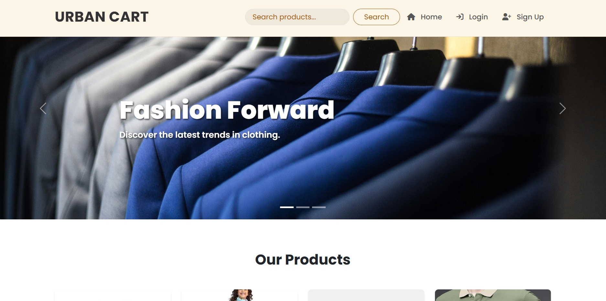
- Products Page
  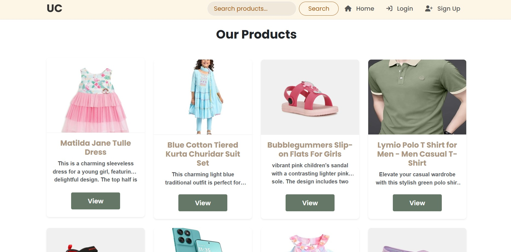
- Login Page
  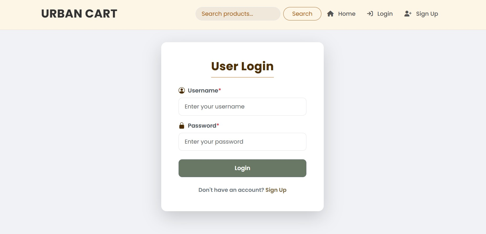
- Profile Page
  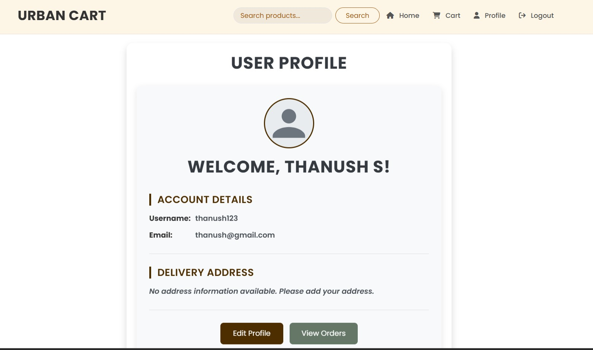
- Product View Page
  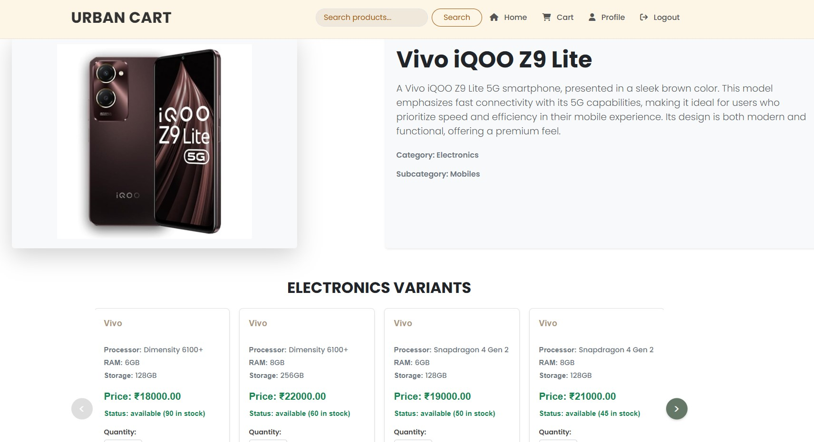
- Cart Page
  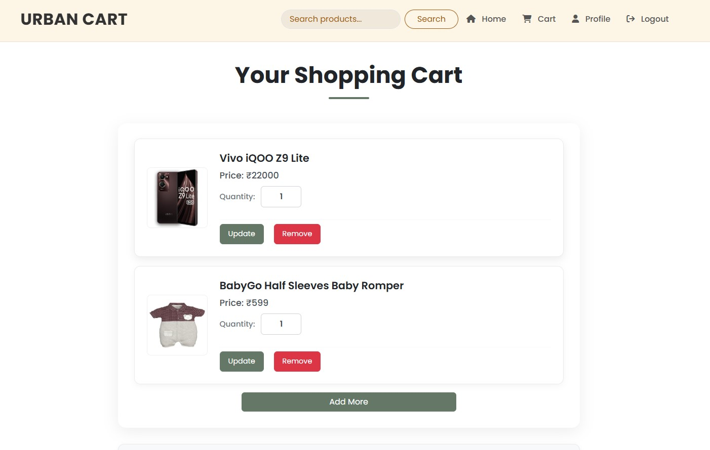
- Order Page
  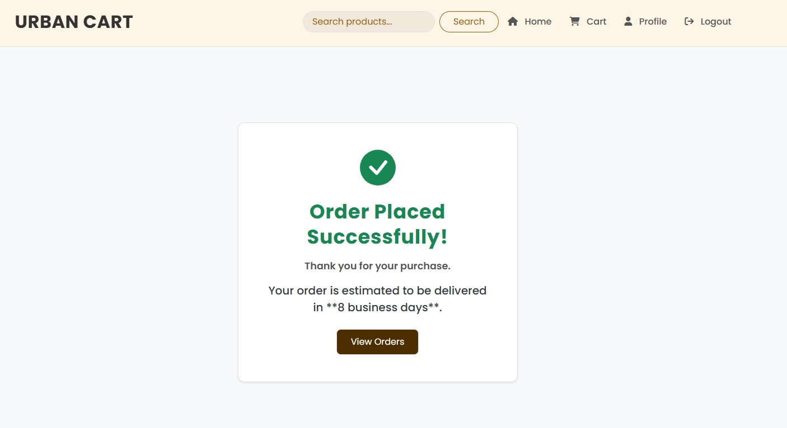
- View Orders Page
  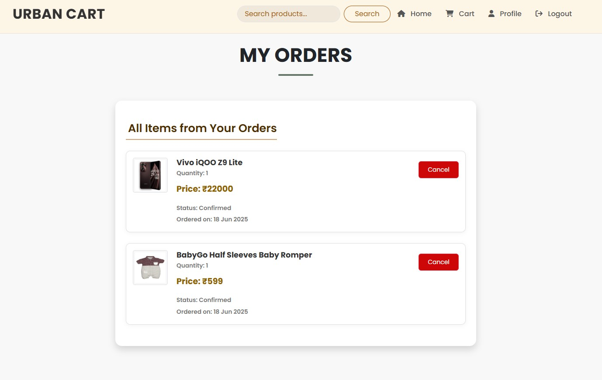

### Admin Side
- Admin Dashboard
  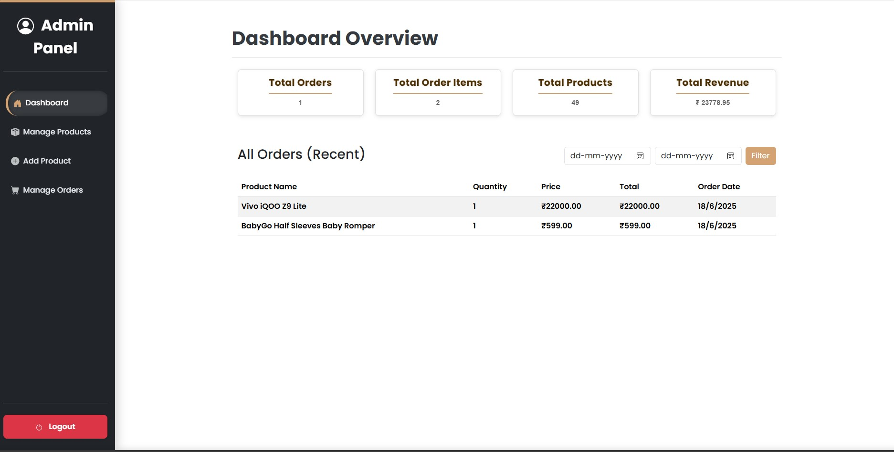
- Product Manage Page
  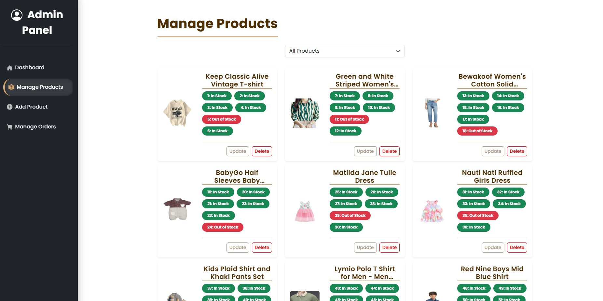
- Product Add Page
  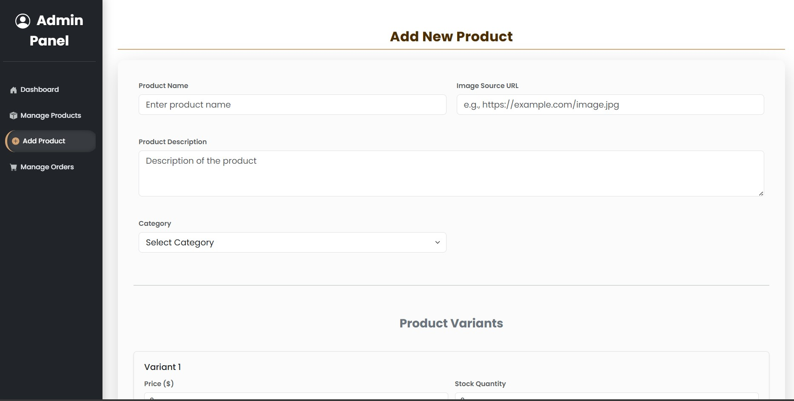
- Manage Order Page
  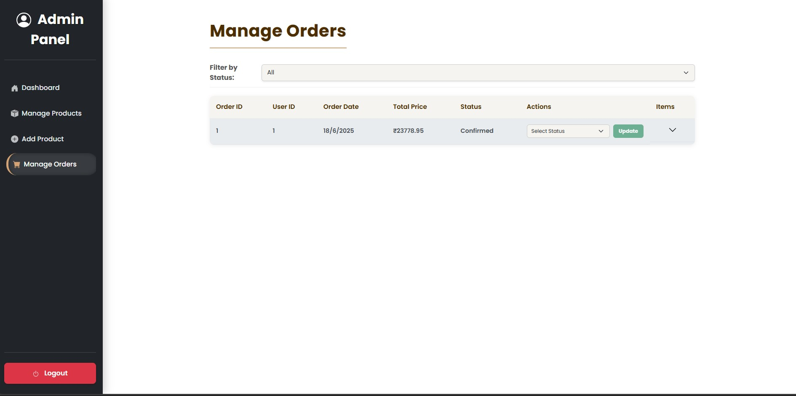
